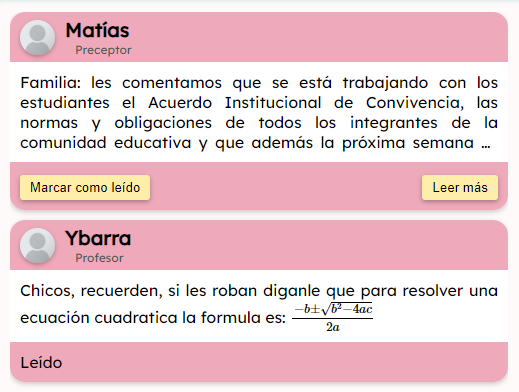
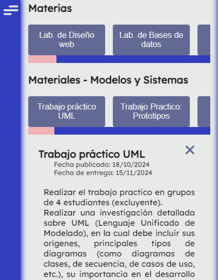

# Changelog

> Empece a hacer el registro de cambio el 29/10.
> 
> Los datos hasta esa fecha son solo los que mea curdo y tenga captura, aunque son muy espaciadas estas para diferenciarlo bien.

---
---

### 10-08
- **Pagina inicial de login**: solicitud de DNI o mail, el DNI se pide como primer ingreso si nunca entro ya que se supone que en el sistema el primer ingreso lo haces con el dni y luego al ingresar te pide guardar un mail y cambiar la contraseña porque las cuentas las crean los preceptores.

- **Primer diseño de las notificaciones**: un diseño bastante croto pero era algo al menos. En este solose represento el dibujo que era ver el el nombre del profesor o preseptor su cargo y el mensaje.

- **Calendario para el usuario**: se diseño un calendario basico, sin mucho estilo ni animatronix. se situaba arriba a la izq el cambio de mes, aunque no funcionaban, y del lado derecho el mes y el año. los dias feriados o por paros se marcaban con el numero en rojo. y se ven unas notas en los dias.


### 25-08
- **Asistencia de alumnos**: Primer diseño del 'resumen de asistencia'

- **Rediseño de las notificaciones**: Se rediseño las notificaciones dividiendolas en 3 fragmentos:
  - frag1: Se agrego una foto de perfil, se ajustaron las posiciones y colores del nombre y rol.
  - frag2: En este se situa el mensaje, limitado a max de 4 renglones visibles, superando este se oculta.
  - frag3: en este sale de manera un btn para marcar como leida la notificacion, y un btn para `ver mas` que estaba establecido para el mensaje que superaba estos 4 renglones.
  
- **Mejoras de calendario**: Se mejora el header del calendario poniendo los btns uno en cada extremo y cambiando su texto a solo las flechas, se le hizo un diseño mas fachero con separaciones y leves borders curvos, las notas dentro de los dias fueron ocultas a sobreesbordamiento y se le agrego un modal que al habrirse ese permite visualisar la nota completa, ademas de que se le agrego para que el usuario pueda agregar las notas. y se diseño el script para hacer el calendario mejor y fncional. con una animacion de expansion en los dias con notas, osea este se expande al pasar viendo la nota mas adecuadamente. aunque achicharaba todo lo demas.

- **Diseño del header**: este fue principalmente planteado del lado izq en modo de desplazamainto.

### 26-08
- **Prediseño del apartado de biblioteca**: se diseño de manera rapida y sencilla.  El apartado de materiales habriria un modal con sus respectivos contenidos.
- 
| v1 | modal |
|-|-|
|||
- **Update del calendario**: se le agrego a los dias de la semana (Lunes a viernes), las faltas para dar mayor informacion al principio:
  - **P**: de color Verde para presente.
  - **T**: de color Azul para tarde.
  - **A**: de color Rojo para ausente.
  

### 27-08
- **Rediseño de las asistencias del alumno**: Se rediseño la tabla de asistencias del alumno, agregando filas para dar un mayor detalle, Taller Teorico, Ed. f. y Faltas por flatas totales del mes.

| v1 | v2 |
|-|-|
|||

- **Apartado de notas y boletin pa el usuario**: Se deiseño un boleetin digital y una tabla de calificaciones bien crota pero funcional.

| boletin v1 | notas v1 |
|-|-|
|||

### 31-08
- **Rediseño de header**: Se diseño un header estatic arriba horizontal y se dejo el desplegable de la izq para tables o -.

| header monitor | header pantalla |
|-|-|
|||

### 3-09
- **Implementacion del desglose**: Se añade un desglose de asistencia al apartado de Asistencias del usuario, seria diferenciar entre ausencias justificadas e injustificadas sin la inclusion de fias por paros (caso de escuala publica). Este es una idea de muestra presentada:


### 04-09
- **Diseño del desglose**: Este fue basado en las asistencias mismas colocadas en el calendario(pagina inicial del usuario) y el resumen de asistencias(mismo sitio).
> Esta  es una foto del actual hasta la fecha(10/11) ya que solo se cambio la paleta de colores.


- **Informacion sobre el calendario**: Se agrego debajo del desglose de asistencias en la pagina de asistencias una informacion muy breve y visual de como se tomaba la lista en caso de malentendidos.

- **Rediseño de la tabla de materias y materiales**: Esta fue rediseñada dividiendo a la mitad, esto fue pensado para que no quede en blanco la otra mitad de la pantalla, lodo derecho, y ahorando el scrollY.

- **Mejoras asistencias en el calendario inicial**: Se mejoro la toma de asistencia en el calendario presente de la pagina de inicio, ahora se incluyen los dias de taller(lunes, martes y miercoles), con una doble marca:
  - **P/P**: taller y teorico presente
  - **P/T**: taller presente y tarde teorico
  - **P/A**: taller presente y ausente teorico
  - y al reves lo mismo seria.Manteniendo para jueves y viernes solo teorico ya que no hay taller.


### 5-09
- **Rediseño del login**: se agrego un fondo de imagen, se le cambio la estetica al formulario y se le agrego registro con nombre de usuario, Se achico el header, y se cambio el titulo principal por la abreviatura.


### 17-09
- **Nueva paleta de colores**: se cambio a una paleta de  colores con sentido, colores mas estilo pasteles. Tambien se agregaron color para todos los btns y su hover
  - ```css
    --texto: #1c1c1c; /*texto negro mas suave*/
    --Bcolor: #e8eae9; /*Background color - blanco  nieve*/
    --Pcolor: #323ebe;
    --Scolor: #4653e6;
    --Tcolor: #858FFF;
    --Ccolor: #8F95DB;
    --Qcolor: #F0B1B7;
    --Sxcolor: #c78b91;
    /* Anterior paleta de colores
    --Pcolor: #0c8680; /*Primer color* /
    --Scolor: #001380; /*Segundo color* /
    --Tcolor: #eab; /*Tercer color* /
    --Ccolor: #aaf; /*Cuarto color* /
    --Qcolor: #fea; /*Quinto color* /
    --Sxcolor: #fef; /*Sexto Color* /
    */
    --btn: #626995;
    --btnHover: #363f7c;
    ```
  

---
---

### 29-10
- **Rediseño de la página de inicio**: 
  - Cambio de formulario de login simple a una página inicial con un banner de presentación.
  - Agregada la historia del colegio (versión inicial).
  - Nuevas secciones: datos del colegio, programas extracurriculares, tasa de graduación, especialidades (mencionadas).
  - Implementación de secciones de portales para alumnos, profesores y cursos (sin funcionalidad de acceso).
  - Sección de ubicación con mapa y contactos en el pie de página.

### 30-10
- **Actualización de la historia**: Se mejoró la redacción y se añadió una imagen.
- **Expansión de información escolar**:
  - Nuevos datos: número de cursos, laboratorios, biblioteca, kiosko, comedor, deportes de vóley, y cantidad de canchas de educación física.
  - Corrección de datos de profesores a +130.
  - Acceso al sitio de la tienda del kiosko.
  - Descripciones detalladas de las especialidades y requisitos de inscripción.

### 31-10
- **Portales de cursos**: 
  - Se añadió una página accesible desde el portal de cursos con una tabla de actividades extracurriculares. 
  - La estructura de la tabla se organizó en base a la información proporcionada por el colegio, que fue inicialmente confusa.

### 01-11
- **Nuevo menú de navegación**: Se agregó un menú desplegable en el encabezado con acceso rápido a la sección de cuentas.
- **Mejoras de diseño**: 
  - La historia y los requisitos de inscripción fueron centrados y mejorados visualmente.
  - Añadida una ilustración a la sección de inscripción para mejorar la estética.
  - Expansión del banner de bienvenida a una altura de 100vh para ocupar toda la pantalla.

### 02-11
- **Adaptación responsiva**: Ajustes para optimización en dispositivos móviles y diversos tamaños de pantalla.

### 04-11
- **Mejoras en la redacción de inscripciones**: La explicación de requisitos se redactó de forma más clara.
- **Optimización de visualización del portal de cursos**: Ajustes en el cuadro para hacerlo más limpio y legible, junto con mejoras en la adaptabilidad responsiva.
- **Idea de galería**: Se propuso y diseñó una galería para la página de inicio.

### 05-11
- **Detalles visuales**:
  - Ajustes en la visualización de tarjetas de datos.
  - Modificación de botones en portales de cursos (cambio de "Salir" a "Inicio").
  - Diseño de galería con tarjeta informativa sobre la cantidad de imágenes y un botón de acceso a la misma.
  - Presentación de imágenes en rotación aleatoria cada 4 s con 5 de los 6 álbumes de imágenes, limitando a las primeras 20 imágenes de cada uno.
  - Estilo de explorador de archivos en la página de galería, similar al sistema iOS.

### 06-11
- **Conversión masiva de imágenes**: Script en Python para convertir 310 imágenes de `.jpg` a `.webp`, reduciendo espacio de 711 MB a 76 MB.
- **Ajustes de diseño y responsividad en la página de inicio**.
- Eliminación de ilustraciones e imágenes en desuso.

### 07-11
- **Optimización de la galería en la página de inicio**: Primer imagen configurada para cargarse en 0.5 s, con problemas pendientes de solución en cuanto al rendimiento.

### 08-11
- **Mejora del script de imágenes**:
  - Registro de imágenes mostradas para evitar repeticiones.
  - Primer imagen ajustada a 10 ms de carga inicial, cargando solo la imagen visible para optimizar el rendimiento.

### 09-11
- **Ajustes en el encabezado (header) de la página de inicio**:
  - **Acceso rápido**: Se mantiene visible el acceso rápido a la cuenta (ícono de usuario) en pantallas pequeñas, mientras que el título del colegio se oculta para optimizar el espacio. Esto facilita la navegación y mejora la visualización en dispositivos móviles.
  - **Menú desplegable**: El ícono del menú desplegable permanece visible en la versión responsiva, ocultándose solo el título del colegio en pantallas pequeñas.

- **Ajustes en el encabezado de portales de cursos y galería**:
  - **Botón de salida (Inicio)**: Se mantiene visible el botón de "Inicio" en el encabezado, mientras que el título del colegio se oculta para mejorar la experiencia de navegación en dispositivos pequeños. Este ajuste se implementa tanto en los portales de cursos como en el de la galería.

- **Corrección en la sincronización del cambio de imagen en la galería de la página de inicio**:
  - Se solucionó el problema en el que la imagen no cambiaba correctamente durante la animación. Ahora, el cambio de imagen ocurre durante la reducción de tamaño y solo después de que la nueva imagen ha sido precargada. Esto asegura una transición más fluida y sincronizada, eliminando el desfase que ocurría previamente al esperar la finalización de la animación antes de cambiar la imagen. Este ajuste mejora la experiencia del usuario al ver las imágenes de la galería.

- **Ajuste de tamaños y márgenes en la tabla del portal de cursos**:
  - Se realizaron mejoras en la visualización de la tabla del portal de cursos, ajustando los tamaños y márgenes para una presentación más clara y organizada de la información.

- **Ajustes adicionales en las secciones del portal**:
  - Se realizaron ajustes en el tamaño y diseño de las siguientes secciones para mejorar la coherencia visual y la accesibilidad:
    - **Portal de cursos**
    - **Galería**
    - **Sección galería completa en el portal de galería**
    - **Sección de ubicación**
    - **Sección de curriculares en el portal de cursos**

- **Modificación en el perfil de usuarios en la sección de asistencias**:
  - Se agregó una columna adicional en la tabla de resumen de asistencias que muestra el total de faltas por área, por ejemplo, las faltas acumuladas en Taller, Teórico, o Educación Física.

| v2 | v3 |
|-|-|
|||

- **Rediseño de la sección de biblioteca**:
La estructura de la tabla de biblioteca fue modificada de un diseño complejo de múltiples columnas para presentar los materiales (Libros, Tareas, Videos) a una presentación más intuitiva, mejorando la visualización y el acceso a los recursos de cada materia.

| v1 | v2 |
|-|-|
|||

### 10-11
- **Diseño del respolsivo biblioteca del usuario**: misma mecanica que la geleria del inicio. 


- **Diseño del menu del profe**: se diseño el menu del profesor con sus notificaciones y clanedario, es tes calendario a diferencia del de usuario solo marca las faltas, ademas de que el profesor puede añadir notas al dia actual o futuro, puede editar notificaciones con un rango de max 7 semana anterior o eliminar notifiaciones del mismo dia o superior. Esto simulario que el profe sube sus notas al calendario las que  veria el alumno digamos. Las notifiaciones no tienen un filtro ya que solo ve las suyas pero se remplazo por un boton con acceso al apartado de notifiaciones que es donde podra subir estas editarlas o borrarlas. Algunas cosas estan sesacomodadas como este btn de notifiaciones o el modal del calendario del profe.

### 11-11
- **diseño del panel de notificaciones**: se diseño el panel para adjuntar notificaciones del lado del profesor, este puede subir nuevas notificaciones, cancelarlas en el proceso, editarlas o cancelar esos edits y eliminarlas, solo las notificaciones con un max de 7 dias para atras.

- **creacion de calendario**: se utiliza el mismo sistema del alumno sin las asistencias, ademas de que en las chefas puede agregar notas, del mismo dia en adelante, editar y eliminar las notas max 7 dias para atras al actual. Las opciones predeterminadas para el tipo de nota a subir son:
  - TP
  - Examen
  - Oral
  - Exposicion
  - Actividad
  - Otro. Se debe especificar en otro input que se visualiza  al seleccioar.

- **creacion de asistencias**: Se deiseño el panel para que nome asistencias el profesor, este cuenta con un sub-header donde con un select puede cambiar el mes, con un btn puede tomar asistencia, este habriendo un modal y recorriendo la lista en orden de lo alumnos a los que les pone Presente o Ausente, y este se va aplicando a una cuadrilla. en la misma cuadrilla tienen para poner todos presentes o ausentes, tomar asistencia manulamente o modificar las falta, este seria por si esta ausente y llega tarde por ej.
- **creacion de notas/calificaciones**: El diseño para que el profesor gestione las calificaciones esta diseñado con la lista de los alumnos del lado drecho, esta cuenta con opciones de filtros, que son:
  - Todos
  - Reprobados 1er Cuatrimestre
  - Reprobados 2do Cuatrimestre
  - Reprobado ambos Cuatrimestres
- y con una opcion para garegar nuevos estudiantes.
- Al Abrir el panel de un alumno haciendo click en el mismo este habre sus datos, un promedio general que se hace mediante otros 3 promedios, Asistencias, Notas y Conducta. Asistencias estaria vinculado a la  cuadrilla de la seccion donde toma asistencia el profesor, nota se calcula con todas las notas del mismo, como tp, carpetas, etc. y el de conducta es un valor modificable por el profesor.
- Luego se destaca el boletin que este indica primer cuatri, 2do y una ves ambos esten se abilita un 3ro de nota final, en el caso de llevarse un cuatrimestre(TEP, TED) este sale con una opcion para indicar si intesifico o no, osea si dio la materia ya sea en medio del otro cuatrimestre o en diciembre.
- luego tiene para las notas donde ti ene dos btns, Agregar calificacion y Agregar nota boletin, en calificacion puede agregar con las opciones de
  - tp
  - carpeta
  - examen
  - oral
  - exposicion
  - act.
  - otro, especificar
- y una nota numerica del 1 al 10 con numeros decimales solo  de 0,5.
- Agregar nota boletin puede agregar al primer o segundo cuatrimestre una sola  ves la nota y sus opciones son TEA, TEP, TED

### 12-11
- **Estilos modal de calendario**: Se diseño la estetica del modal en el que el profesor sube notas al calendario con sus version responsil.

| monitor | pantalla |
|-|-|
|||
  
- **Estilos de notificaciones**: Se diseña el